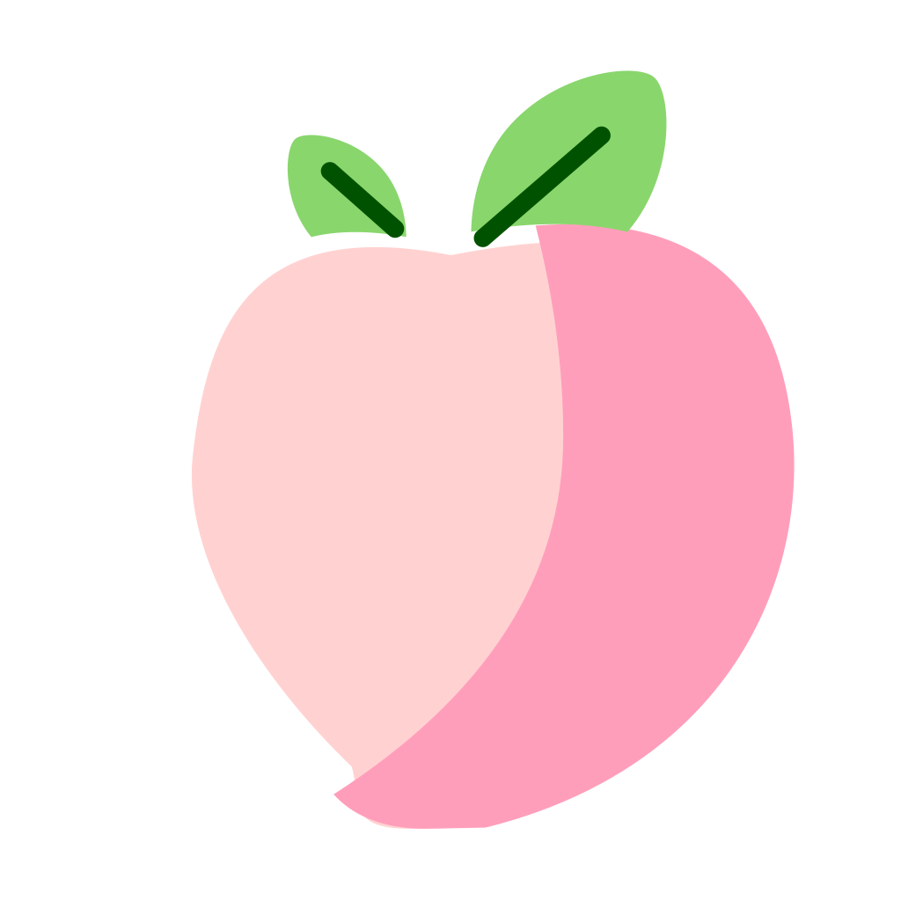

  
   SearXNG x Peach

---

Pastel colored theme for [SearXNG](https://github.com/searxng/searxng) based around the color of a peach.

## Optional Dependencies
#### Font Families - Recommended
* IPAex Gothic
* [League Spartan](https://fonts.google.com/specimen/League+Spartan)
* [Comfortaa](https://fonts.google.com/specimen/Comfortaa?query=Comfortaa)

## Contributing
Fixes for different screen resolutions and inconsistencies between elements are warmly welcomed.

## Credits
* [モモ](./Peach.svg) from [SVGrepo.com](https://svgrepo.com) under the [CC0 License](https://creativecommons.org/public-domain/cc0)
